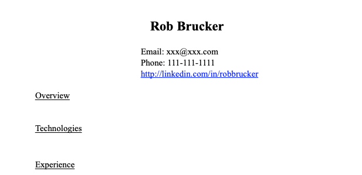

# resume_tweaker
Put in a job description and your resume, and use AI to tweak your resume to the job description

## Getting started
- Generate OpenAI key and put it in a file called .env 
```OPENAI_API_KEY=yourkey```
- Change the constants file, `skills` and `full_name`
- Make sure your resume has a header called Overview and another called Technologies (like image below)

## Installing
# 1. Install Docker

# 2. Build docker image
`docker build -t resume-tweaker . `

# 3. Run
`docker run -p 5000:5000 resume-tweaker`